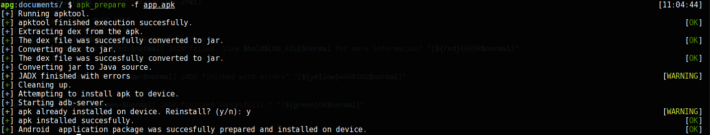
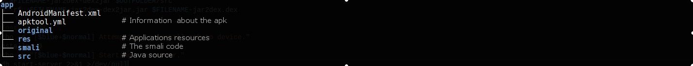
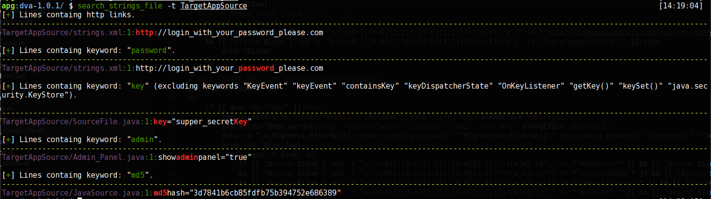

# Android-Automation
This is a collection of script I created in order to automate certain tideious and time consuming tasks performed during a Android Penetration Assessment. A description of each script follows.
## apk_prepare.sh
A bash script that decompiles the apk, producing both the source in Java and the smali. The files are aranged neatly in a simple folder structure. The script also attempts to install the application on the device. The boring stuff are over! Happy hacking. 
### Requirements
* [apktool](https://ibotpeaches.github.io/Apktool/install/)
* [d2j-jar2dex.sh](https://github.com/ufologist/onekey-decompile-apk/blob/master/onekey-decompile-apk/_tools/dex2jar/d2j-jar2dex.sh) as d2j-jar2dex, simply create symbolic link `ln d2j-jar2dex.sh d2j-jar2dex` inside PATH
* [d2j-dex2jar.sh](https://github.com/ufologist/onekey-decompile-apk/blob/master/onekey-decompile-apk/_tools/dex2jar/d2j-dex2jar.sh) same as above
* [jadx](https://github.com/skylot/jadx#building-from-source)

OPTIONAL
* [adb](https://developer.android.com/studio/command-line/adb.html) Required to install application on connected device.

### Usage
`apk_prepera.sh apk_prepare -f <target.apk> [-o <output folder>]`

## search_strings_file.sh
A bash script used for static analysis on the applications source. It searches for strings, as provided by the configuration file. The default configuration file is at the script's base directory, named `..search_strings_config`.
The script will search by default for `http:// ` links since it is something you should be looking for anyway _see [MiM](https://en.wikipedia.org/wiki/Man-in-the-middle_attack)_. The script also attempts to get rid some of the riffraff when searching for the string `key`.

## adb_screencap.sh
This is a simple script that takes a screenshot of the screen currently displayed on the phone. It stores the screen on the screenshot directory of the Project. To use, please modify it and add your root directories. 
## sign_apk.sh
Small wrapper script used to sign an apk so it is possible to install it on an Android device, after patching it. It requires [sign.jar](https://github.com/appium/sign) to be in the `/usr/local/bin` directory.
